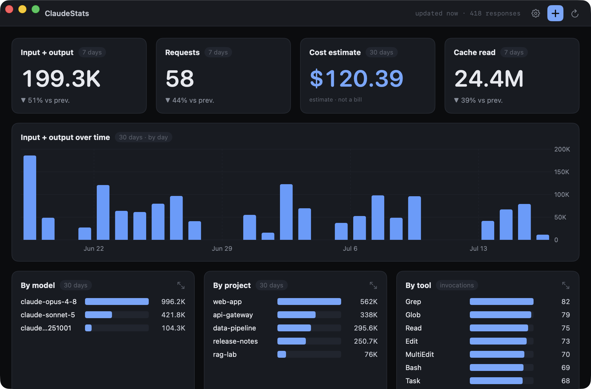
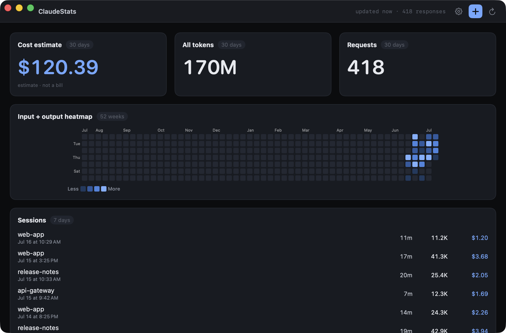

<div align="center">


# ClaudeStats

**A native macOS dashboard for your Claude Code token usage —**
**over time, and across projects, models and tools.**

[](https://github.com/oustrix/claudestats/actions/workflows/ci.yml)


[](LICENSE)

</div>

It reads `~/.claude/projects/` and writes nothing there — the only files it creates are its
own layout, settings, and pricing table, in Application Support.

<div align="center">





<sub>Screenshots use a synthetic corpus, not real data.</sub>

</div>

## Build and run

Requires macOS 26 and the Xcode toolchain. There is no `.xcodeproj` — the project is a
Swift package, built through `make`:

| Command | What it does |
|---|---|
| `make run` | Launch the app from source. |
| `make app` | Assemble `ClaudeStats.app` (a release build plus a generated `Info.plist`). |
| `make test` | Run the test suite. |
| `make dump [ROOT=<dir>]` | Print the same numbers the dashboard draws, for the terminal. |
| `make clean` | Remove build artifacts. |

`make app` produces `ClaudeStats.app` in the repository root. Copy it to `/Applications`
if you like, or launch it in place.

**First launch.** The app is unsigned (ad-hoc), so macOS will refuse to open it the first
time. Open **System Settings → Privacy & Security**, find the blocked-app notice near the
bottom, and click **Open Anyway**. This is a one-time step. The app is not sandboxed —
that is deliberate, because a sandboxed app cannot read `~/.claude`. The cost is that it
cannot ship through the Mac App Store, which is not a goal.

## The dashboard

The window is a grid of blocks. Each block is one of six types, and you set its parameters
yourself:

- **Number** — a single headline figure for a metric and timeframe.
- **Cost** — a headline dollar estimate for a timeframe (see below).
- **Chart over time** — a metric bucketed by day or hour.
- **Breakdown** — a metric ranked by model, project, or tool.
- **Heatmap** — a calendar of activity, one cell per day.
- **Sessions** — recent sessions, newest first.

Add a block from the toolbar's **+** menu — reorder, resize its span, edit parameters, or
remove it from the controls on each block. Every change is saved immediately.

The layout lives at `~/Library/Application Support/ClaudeStats/layout.json`. It is plain,
readable JSON — edit it by hand if you prefer. A block whose type this build does not know
is skipped with a notice, not a crash; a file that will not parse is moved aside to
`layout.json.bak` and replaced with the default.

## What the numbers mean

- **Tokens are counted once per response**, even though Claude Code writes each response
  across several lines in the transcript. Getting this wrong inflates the count by roughly
  2.3×; the app's totals match `ccusage` exactly.
- **Cost is an estimate, not a bill.** The dollar figures come from a pricing table you edit
  yourself (**Settings → Pricing**, or `pricing.json`) — token counts are recorded facts, a
  price table is not, and a stale one lies silently. Hide every cost block from settings if
  you would rather not see a number that can drift.
- **Cache reads dominate** — over 90% of all tokens on a typical corpus. That is why the
  default headline is input + output, not "all tokens": an all-tokens headline would really
  be a headline about the cache.
- **A day is a local calendar day.** An evening session counts toward the day you were
  working, not the UTC date.

## Verifying

`make dump` prints the same aggregates through the same code the dashboard uses, so you can
check them against an independent tool:

```
make dump | head
ccusage claude          # totals should agree to the token
```

The dump also prints the naive per-line sum and how far off it is, so you can see the
counting rule doing its job.
